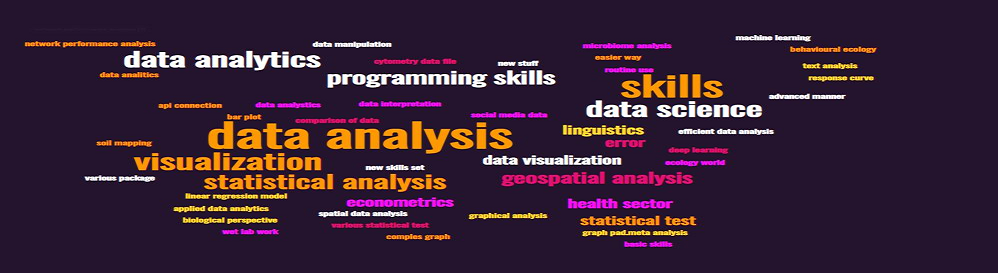

```{r setup, include=FALSE}
knitr::opts_chunk$set(echo = FALSE)
library(knitr)

# Learn more about creating websites with Distill at:
# https://rstudio.github.io/distill/website.html

```

<!-- ```{css} -->
<!-- .article-banner { -->
<!--   width: auto; -->
<!--   height: auto; -->
<!--   border: 0; -->
<!-- } -->

<!-- img[src="assets/images/banner.png"] { -->
<!--   border: 0; -->
<!--   padding: 0; -->
<!--   width: 100%; -->
<!--   margin: 100px 25px 0px 0px; -->
<!-- } -->
<!-- ``` -->

<!-- ```{r, layout="l-screen-inset"} -->
<!--  -->
<!-- ``` -->


Love is in the rrR...  

 Series of R sessions are designed to enhance the coding skills of people interested to learn R programming language. It is a non-profit venture and charges no fee from learners. All the time and efforts are driven to help othersfacing difficulty in R. We also express our heartfelt gratitude to all the mentors who volunteered to lead and teach us R language. We truly appreciate their time, efforts and commitment. Together, we build a strong team. We expect nothing in return from learners. Just a simple request, if you have been benefitted from these series in any way, please try to give it back to others who are in neeed. Let's build a strong community.

`Love is in the rrR...` was created to bring together the R coders lovers who wants to start learning R and become an expert in R. The main purpose of this club is to share knowledge and expertise from the expert mentors to the members of this group. Series of online session will be conducted by our mentors on a specific topics from the basic of R to a more advance technique in R. It is our goals that everyone in this group, one day will be an expert and in return be a mentor to the newcomers in R.  

This group is growing rapidly since it's first session on July 15, 2022. As of 19 July 2022, we already have 242 members and the numbers are growing.  

To join the WhatsApp group chat, just click here -->
<a href="https://chat.whatsapp.com/GQe2s2nLI8EALagG2LJcxO" target="_blank">Join WhatsApp Group Chat</a>  


## Webmasters {.appendix}

:::::: {style="display: flex; "}

::: {.column width="25%"}

{width="80%"}

:::

::: {.column width="75%}

#### KAMARUL ARIFFIN MANSOR\
Designation: Senior Lecturer (Applied Statistics)\
Affiliation: MARA University of Technology, Malaysia\
Email: kamarul.ariffin.167118@gmail.com\
[Website](https://ariff118.github.io/kamansor.github.io/)

:::

::::::

