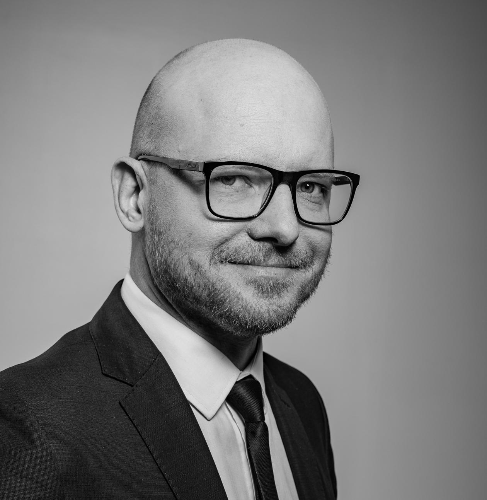

```{r setup, include=FALSE}
knitr::opts_chunk$set(echo = FALSE)
```

## Founder

:::::: {style="display: flex; "}

::: {.column width="25%"}

{width="80%"}

:::

::: {.column width="75%}

### Ishveen Kaur\
MS (University of Texas at RGV, Texas)\
BS (Punjab Agriculture University, India)\

The idea of developing a global education network of learning R\
was initiated, conceptualised and executed by me. The thought\
behind this idea was to create a global network/ community of\
people interested in coding where we all can learn from\
each other and help each other grow. There is lot of stuff\
online, but still large proportion of people face difficulty\
in learning R, due to lack of interactive and one on one\
session. This idea led to creation of global interactive platform\
to bring learners and mentors together, leading to creation R club,\
consisting of several sessions from basics of R to advanced R. My\
basic responsibilities include communication with mentors\
and learners in designing schedule and course outline of\
workshop, co-ordinating the sessions and acting as moderator\
to cater to needs of both mentors and leaders.\

Quote: *If life throws lemons at you, make a\
lemonade out of it and chill*.

:::

::::::

***

## Mentors

:::::: {style="display: flex; "}

::: {.column width="25%"}

{width="80%"}

:::

::: {.column width="75%}

### Indrek Seppo\
*Designation*: Economist, Data Scientist, R programmer, Lecturer\
*Affiliation*: University of Tartu\
*Email*: indrek.seppo@gmail.com\
[CV](R_Eng_2020/CV_IndrekSeppo_eng.pdf)  

:::

::::::

***

:::::: {style="display: flex; "}

::: {.column width="25%"}

{width="80%"}

:::

::: {.column width="75%}

### Tessa Ruth\

*Designation*: Ph.D student\
*Affiliation*: University of Queensland\
*Country*: Australia\
*Email*: tessc@live.com.au\

My name is Tessa Clarkson, I am a PhD Candidate at the\
University of Queensland, Australia. I have an interest\
in social cognition, memory, the self, and ownership. I am\
a self taught R coder and use R for behavioural data analysis\
and visualisation.\


:::

::::::

***

:::::: {style="display: flex; "}

::: {.column width="25%"}

{width="80%"}

:::

::: {.column width="75%}

### Faustino Delgado Camacho\
*Designation*: Genotypic Data Analyst\
*Affiliation*: \
*Country*: Mexico\
*Email*: faustdelcam@gmail.com

:::

::::::

***

:::::: {style="display: flex; "}

::: {.column width="25%"}

{width="80%"}

:::

::: {.column width="75%}

### Elijah Appiah\
*Country*: Ghana\
*Biography*: Economist by profession, and passionate\
about Data Science and AI.\
*Technical Skills*: Excel, SPSS, Stata, Eviews, Python,\
R, Tableau, Power BI, Google, TensorFlow.\
*Skills in R*: Basics in R, Data Types and Structures,\
Data Manipulation and Wrangling, Statistical Analysis,\
Tidyverse, Tidymodels for Machine Learning, Blogdown,\
Markdown, Shiny Web Applications, Time Series Analysis.\
*Email*: appiahelijah497897@gmail.com

:::

::::::


## Webmasters {.appendix}

:::::: {style="display: flex; "}

::: {.column width="25%"}

{width="80%"}

:::

::: {.column width="75%}

#### KAMARUL ARIFFIN MANSOR\
Designation: Senior Lecturer (Applied Statistics)\
Affiliation: MARA University of Technology, Malaysia\
Email: kamarul.ariffin.167118@gmail.com\
[Website](https://ariff118.github.io/kamansor.github.io/)

:::

::::::

